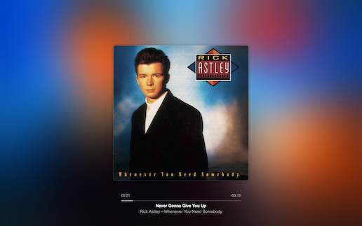

# NowPlaying for [Übersicht](http://tracesof.net/uebersicht/)



An Apple Music style now playing widget.

[GitHub](https://github.com/cdltlehf/youtube-now-playing-widget/tree/main)

## Dependencies

- [nowplaying-cli](https://github.com/kirtan-shah/nowplaying-cli)

## Installation

```bash
make install
```
